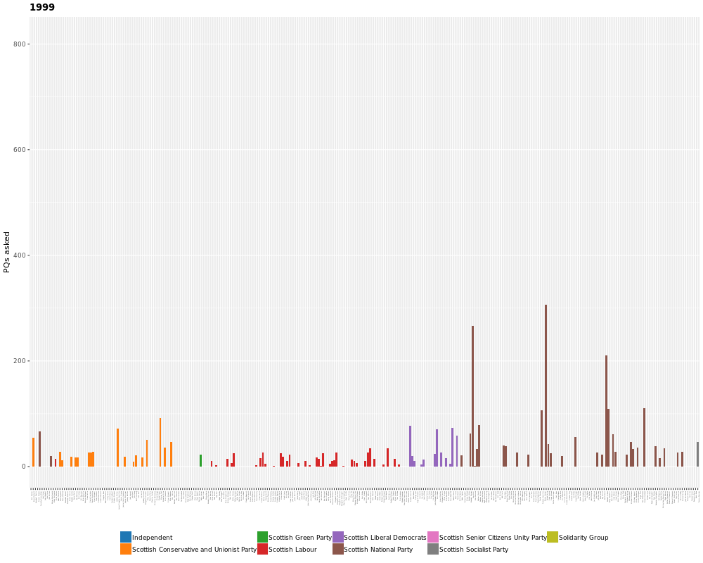
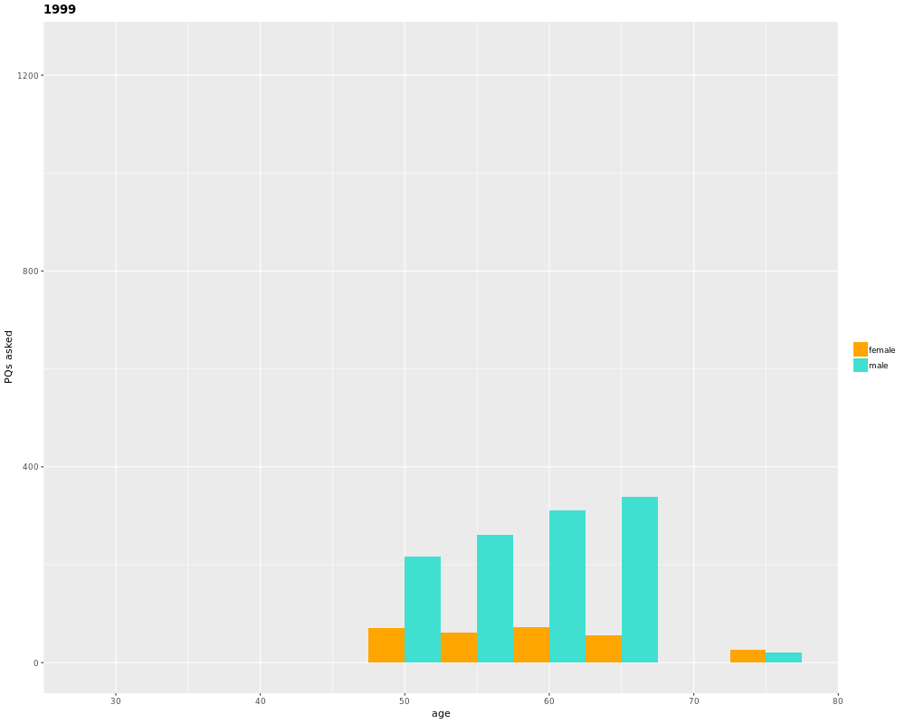
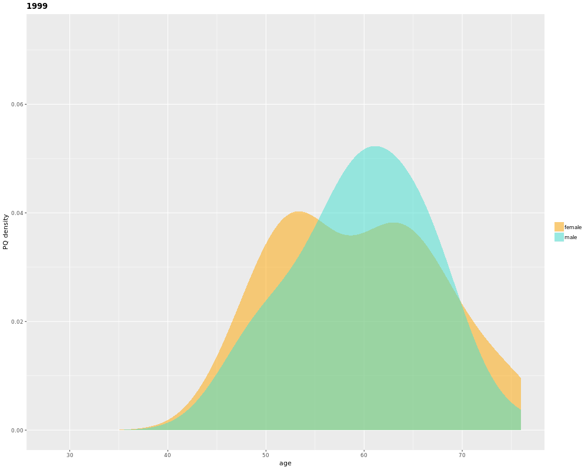

```{r setup, include=FALSE}
knitr::opts_chunk$set(echo = TRUE)
```

## Introduction
I recently discovered that – 

* the Scottish Parliament has a very useful collection of [OpenData](https://en.wikipedia.org/wiki/Open_data) [datasets](https://data.parliament.scot/)
* there's an R package called [`gganimate`](https://github.com/thomasp85/gganimate) that can be used to create plot animations.

Why not stick them together?

## Plots
The `code.R` script contains the function `generate_archive_opendata` – this accesses the Scottish Parliament's Open Data API and downloads an archive of MSP's Parliamentary Questions since 1999, and then formats/tidies the data etc.

We can use the standard `ggplot` and other `tidyverse` tools to reshape the data as required, and `gganimate` can then be used to animate how things change over time.

### MSP PQ Activity Over Time
Here we can see how many questions each MSP asked in each year (coloured by the MSP's party).


OK, so the MSP names are unavoidably ... somewhat small. And there are only really ~20 time points, with the in-between frames being interpolated by `gganimate`. But it's still fun (and useful) to be able to easily explore the data in this way.

Let's take a look at how the gender balance and age distribution has changed in the same time period.

### Age & Gender

Here we have a histogram of age bins (5 years wide) for male and female MSPs (plotted next to each other). Broadly speaking, it looks like the MSPs asking questions asked in the Scottish Parliament have been getting younger (and *maybe* more female?) over time.



This is nice, but arguably a bit visually confusing. We can smudge things out a bit by plotting a [kernel density](https://en.wikipedia.org/wiki/Kernel_density_estimation) instead of a histogram.



## Conclusion

`gganimate` looks like it will be a very useful tool for data visualisation. Possibly care will have to be taken when it comes to choosing how to interpolate and transition; I'd probably err on the side of linear linterpolation for *important* data, unless there's a good reason not to. Also worth tipping the hat to hat to the Scottish Parliament, as their Open Data API is very easy to use and open to all. Good stuff all round really.